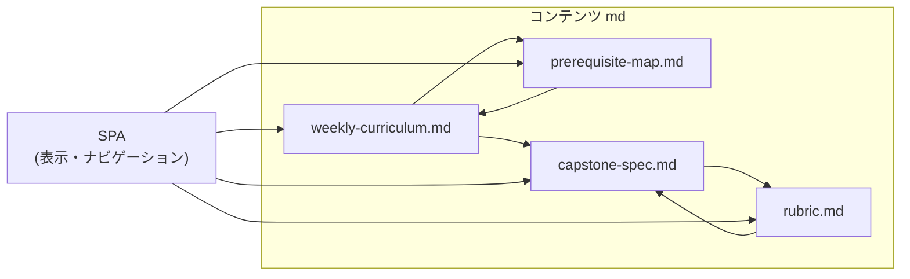

# AoyamaCreate カリキュラム草案 徹底レビュー

## 前提の曖昧さ・欠落

- **「未経験 0」の定義が不明**: プログラミング経験ゼロなのか、HTML/CSS に触れた程度も含むか。数学・英語のレベル（高校何年程度）の想定がない。英語のエラーメッセージやドキュメント読解をどこで補うか未記載。
- **高校生の時間前提**: 6〜8 ヶ月で全 Stage を消化するが、週何時間・フルタイムかパートタイムかが書かれていない。在学中なら学校・行事・アルバイトとの両立設計が必要。
- **「最強の次世代エンジニア」の定義がない**: どの企業規模・どの職種（自社開発／SI／スタートアップ）を想定するか不明。期待値を高くしすぎると挫折時のダメージが大きい。
- **卒業後の出口が書かれていない**: 就職支援・ポートフォリオの見せ方・面接対策・認定（資格か修了証か）の有無がカリキュラム外。

---

## ゴール定義の不備・懸念

- **「単独で完遂」の現実性**: 要件定義〜監視まで 1 人で完遂できることをゴールにすると、チーム開発（コードレビュー・役割分担・コミュニケーション）の経験が不足するリスクがある。就職先によっては「単独」より「チームで一気通貫」の方が需要が高い場合もある。
- **設計の用語とカリキュラムの対応**: ゴールに「設計（ER / C4 / ADR / 脅威モデリング）」とあるが、**C4 モデル**と**ADR（Architecture Decision Record）**がどの Stage でどのように登場するか本文に一切ない。ER は Stage 4、脅威モデリングは Stage 8 のみ。C4・ADR は追加するか、ゴールから外すかのどちらかに揃える必要がある。
- **監視設計の具体不足**: ゴールに「監視設計」とあるが、Stage 8 では「アラート設計」のみ。メトリクス種別（RED/USE 等）、ダッシュボード、ログ retention など監視設計の範囲が薄い。

---

## Stage 1：AI 統合開発基盤 — 不足・不備・不要

- **プログラミング入門が欠落**: 「未経験 0」でいきなり Git（rebase / squash）・PR・要件定義の型をやらせている。**変数・分岐・ループ・関数**といった基礎がどこにもない。Stage 1 の前か、Stage 1 の前半に「プログラミングの最小限（1 言語でよい）」がないと、PR ベースの開発は成立しない。
- **Git の順序が逆**: rebase / squash / ブランチ戦略の前に、clone / commit / push / branch / merge の基礎が必須。未経験にいきなり rebase は負荷が高い。
- **提出物と実装のギャップ**: 提出物が「PR テンプレート・DoD・AI 利用ポリシー」のみで、**コードを書く課題がない**。文書だけでは「開発の型」は身につきにくい。
- **AI 禁止領域の境界が曖昧**: 「認証・権限・決済・暗号・セキュリティ系ロジック」は AI 禁止とあるが、Stage 4 で「認可設計」、Stage 8 で「RBAC 設計」を教える。どこまで AI 可でどこから必ず人間が検証するか、Stage ごとに書いた方がよい。また「禁止」より「**必ず人間が検証する領域**」と表現した方が、AI 活用と両立しやすい。
- **不要・冗長の可能性**: 「AI 禁止」を最初に強調しすぎると、AI を活用するメリットを活かしきれない。バランスの記載（何は AI に任せ、何は自分で書くか）があるとよい。

---

## Stage 2：Web 基礎解体 — 不足・不備

- **正常系が先にない**: 「通信障害を切り分けられる」が目標だが、その前に「ブラウザとサーバの役割」「HTTP リクエスト/レスポンスの基本（正常系）」を扱う段階が明示されていない。異常系だけでは土台が弱い。
- **Linux の導入がない**: ps / top / ss / netstat の前に「なぜ Linux を触るか」「ターミナル・シェル・基本的なファイル操作」がない。未経験には用語の壁が大きい。
- **プログラミングとの接続**: Stage 1 で「開発の型」、Stage 2 で「通信と OS」とあるが、まだ**どの言語で何を書くか**がカリキュラム上に見えない。Stage 3 で React、Stage 4 で Laravel と突然出てくるため、Stage 2 までに「簡単な HTTP サーバを触る/書く」などの橋渡しがあるとよい。

---

## Stage 3：フロント実務 — 不足・不備

- **HTML/CSS/JavaScript の欠落**: 「未経験 0」で**React + TypeScript**から入るのは現実的でない。DOM、イベント、非同期（Promise）の基礎がカリキュラムにない。Stage 3 の前に「Web フロントの基礎（HTML/CSS/JS）」を入れるか、Stage 3 の冒頭に組み込む必要がある。
- **TypeScript の記述が薄い**: 「型駆動開発」とあるが、型の書き方・interface・ジェネリクスなどの学習順序や時間配分の記載がない。
- **API 連携の前提**: フロントで API 連携するとき、バックエンドがまだない（Stage 4 が後）ならモックや MSW などの方針が書かれていない。Stage 3 と 4 の順序・並行の意図が不明。

---

## Stage 4：バックエンド — 不足・不備・懸念

- **技術スタックの固定**: Laravel（PHP）のみ。Python（Django/FastAPI）や Node.js を選べるかが書かれていない。事業として PHP/Laravel に絞る意図なら、その理由を明記した方がよい。
- **用語の羅列で深度不明**: MVC / Policy / Queue / Mail / API 設計 / OpenAPI 生成 が並んでいるが、**何時間で何をどこまでやるか**が不明。Queue や Mail は「触れる」程度か「設計できる」までか。
- **業務知識の前提**: 「承認フロー付き受注 API」は業務ドメインの理解が必要。高校生が「受注」「承認フロー」を理解するための説明やシナリオがカリキュラムに含まれているか不明。
- **フロントとの順序**: バックエンドを先にすると UI のニーズが分かりにくい。フロントを先にすると API の形がまだない。**並行か、どちらか先行か**を設計思想として書いた方がよい。

---

## Stage 5：データ設計 — 不足・不備

- **RDB の明示がない**: 「EXPLAIN で説明できる」とあるが、MySQL か PostgreSQL か、または両方かが書かれていない。Laravel なら MySQL/PostgreSQL が一般的だが、明示されていない。
- **分離レベルの難易度**: トランザクション分離レベルは理論が重い。未経験にはまず「トランザクションで何が守られるか」の直感から入り、その後に分離レベルを軽く触れる順序の方が安全。
- **Redis の範囲**: 「Redis キャッシュ」のみ。セッションストアやキュー（Laravel Queue の driver）としての Redis に触れるかどうかが不明。
- **Stage 4 との重複感**: トランザクションは Stage 4「トランザクション設計」でも触れるはず。Stage 4 と 5 でトランザクションの役割分担（4 ＝アプリ設計、5 ＝ DB・性能）を明示するとよい。

---

## Stage 6：品質保証 — 不足・不備

- **ツールの具体が書かれていない**: Unit / Integration は言語・フレームワークに依存する。PHPUnit（Laravel）・Jest/React Testing Library（フロント）など、**何を使ってどこまで書くか**が不明。フロントとバックで別ツールになる負荷をどう扱うかも未記載。
- **CI の実行環境**: 「CI で強制」とあるが、CI の実行環境（GitHub Actions 等）がローカルかクラウドか、Stage 7 の AWS との関係（CI は Stage 6 で導入し、Stage 7 で AWS と連携するか）が書かれていない。
- **カバレッジの罠**: 「テストカバレッジ 70%以上」は数値目標として分かりやすいが、**カバレッジが高くても品質保証にならない**（無意味なテストの増加）という注意がカリキュラムにないと、誤った最適化を招く。
- **静的解析の対象**: PHPStan/ESLint 等、どのツールをどの Stage で導入するかが不明。

---

## Stage 7：AWS & IaC — 不足・不備・懸念

- **Docker の欠落**: ECS（Fargate/EC2）の前に**コンテナ・Docker**の概念と基本操作がカリキュラムにない。Dockerfile・イメージ・コンテナの理解なしに ECS は説明が難しく、「10 分で環境再現」も現実的でない可能性がある。
- **Terraform の前提が薄い**: state 管理・remote backend（例: S3 + DynamoDB）の説明がない。チームや本番では必須の話題。
- **VPC の難易度**: サブネット・NAT・IGW・セキュリティグループは概念が多く、高校生が理解するには時間がかかる。どこまで「設計」でどこまで「写経で動かす」か、段階が欲しい。
- **「10 分で環境再現」の検証**: 実際に Terraform apply からアプリが動くまで 10 分でできるか、ネットワーク・RDS の初期化などを含めると難しい可能性がある。目標の検証が必要。

---

## Stage 8：セキュリティ & 運用 — 不足・不備

- **OWASP の優先順序**: 「OWASP 再現演習」とあるが、Top 10 のどれをどの順でやるか（SQL インジェクション・XSS・CSRF・認証破綻等）が Stage 内で不明。時間制約を考えると優先度の明示があるとよい。
- **構造化ログの位置づけ**: 構造化ログを「Stage 8 で学ぶ」のか「Stage 4 で実装し、Stage 8 で設計・運用観点を整理する」のかが不明。
- **ポストモーテムの限界**: 「疑似障害 → 切り分けレポート」はよいが、本当のポストモーテム（当事者としての振り返り・再発防止）とは体験の質が違う。目的を「レポート作成」に限定するならそれでよいが、文化としてのポストモーテムは別途説明があるとよい。
- **オンコールの扱い**: 「インシデント対応できる」が目標だが、実際のオンコールや Slack 対応まで含めるかは書かれていない。含めないなら「レポート作成・切り分け」に限定すると明確。

---

## Final Capstone — 不足・不備・懸念

- **要件の過多**: B2B 業務アプリ・承認フロー・権限管理・監査ログ・CSV 連携・非同期ジョブ・AWS デプロイ・IaC・CI/CD・脅威モデリング・監視を**すべて 1 プロジェクト**でやると、6〜8 ヶ月の最後の期間では時間が足りない可能性が高い。スコープの優先順位（必須／推奨）や、チームで分担する前提かが書かれていない。
- **評価 5 軸との対応**: 設計・品質・セキュリティ・運用・AI 統合の 5 軸と、Capstone の各要件（例：監査ログ → 設計＋セキュリティ）の対応が一覧になっていない。採点時にぶれが出る。
- **完全仕様書の有無**: 本文末尾で「Capstone の完全仕様書を作る」が選択肢として出ているため、現時点では Capstone の仕様は例示レベルで、詳細は未定。

---

## 全体構成・用語・形式の不備

- **Stage 番号と Final**: 表では Stage 1〜8 と Final（Capstone）だが、Final が「Stage 9」なのか「番号なし」なのかが曖昧。表の表現を統一するとよい。
- **「提出物」と「課題」の混在**: Stage 3・4 では「課題」と「提出物」が別に書かれているが、他 Stage では「提出物」「課題」の使い分けが統一されていない。**課題＝やること、提出物＝成果物**など定義を 1 か所で明示するとよい。
- **週単位・時間配分がない**: 各 Stage に「何週」「何時間」の記載が一切ない。6〜8 ヶ月で 8Stage+Capstone をどう割り振るかが読めない。
- **教材形式の未定義**: 動画・テキスト・ライブ講義・ハンズオン・自習の割合が不明。講師・メンターの役割と人数想定もない。
- **脱落・つまずき対策がない**: 未経験 0 は離脱しやすい。メンタルヘルス・つまずき時のサポート・リメディアルの有無が書かれていない。
- **カリキュラム改善のループ**: 受講生アンケートや振り返りで Ver1.1 に反映する仕組みが記載されていない。

---

## 評価まわりの不備・懸念

- **5 軸と Stage 別評価の対応**: 各 Stage の「✅ 評価基準」と、全体の「5 軸（設計・品質・セキュリティ・運用・AI 統合）」が**Stage 単位でどう対応するか**が明示されていない。例：Stage 3 は「設計・品質・AI 統合」のみで「セキュリティ・運用」は後でまとめて評価する、など。
- **AI 統合軸の性質**: 「AI を適切に使えているか」は、他 4 軸（設計・品質・セキュリティ・運用）がスキル・成果物の質であるのに対し、**ツール利用の適切さ**という別性質。評価方法（ルーブリック）を別設計にするか、他軸と統合するかを検討した方がよい。
- **ルーブリック未整備**: 本文末尾で「採点ルーブリック（点数配分付き）を作る」が選択肢になっており、現状は評価基準が定性表現のみで、採点の再現性が取りにくい。

---

## その他・倫理・法・差別化

- **著作権・ライセンス**: 写経・OSS 利用・ライセンス表記の教育がない。就職後そのまま使うと問題になりうる。
- **倫理**: 個人情報の扱い・差別的アルゴリズム・AI 倫理に触れるかが未記載。次世代エンジニアなら軽くでも触れた方がよい。
- **「ここが AoyamaCreate の差別化ポイント」**: 受講生向けカリキュラムではなく事業・販促向けの文章。カリキュラム本体と別ドキュメント（例：事業説明用）として持つか、受講生向けには「このカリキュラムの特徴」として言い換えるとよい。いらないわけではないが、**配置と読者**を分けた方がよい。
- **事業モデル**: 受講料・奨学金・無料枠・支払い条件が設計書にない。カリキュラムの詳細度には直接関係しないが、高校生を想定するなら経済的障壁の記載があると親・学校との調整で有利。

---

## まとめ：優先して直すとよい項目（抜粋）

| 種別         | 内容                                                                                                                             |
| ------------ | -------------------------------------------------------------------------------------------------------------------------------- |
| 致命的な不足 | プログラミング入門（変数・分岐・ループ・関数）がどこにもない。Stage 1 をプログラミング入門として設ける（前提・決定事項で確定）。 |
| 致命的な不足 | HTML/CSS/JavaScript の基礎なしに React+TS は無理。Stage 3 の前または冒頭に必要。                                                 |
| 致命的な不足 | Docker/コンテナの記載がなく、Stage 7 の ECS の前提が欠けている。                                                                 |
| 不備         | ゴールの C4・ADR がカリキュラム本文に登場しない。追加するかゴールから外すか。                                                    |
| 不備         | 「提出物」と「課題」の定義と表記の統一。Stage と Final の番号・呼び方の統一。                                                    |
| 不備         | 週単位・時間配分・教材形式・講師想定の明示。                                                                                     |
| 懸念         | 「単独で完遂」とチーム開発経験のバランス。「最強」の定義と期待値の具体化。                                                       |
| 懸念         | Capstone の要件が多すぎる。スコープの優先度または期間・チーム分担の明示。                                                        |
| 検討         | 評価 5 軸と Stage 別評価の対応、AI 統合軸の評価方法、ルーブリックの整備。                                                        |

---

## 次の段階「どれを先に作るか」への回答

- **事業的に価値が高い順**:
  1. **各 Stage の週単位カリキュラム** … 時間配分と前提が決まらないと、ルーブリックも Capstone 仕様もぶれる。
  2. **Capstone の完全仕様書** … 卒業時のアウトプットを固めることで、各 Stage の「何のためにやるか」が明確になる。
  3. **採点ルーブリック** … 評価の再現性とフィードバックの質のため重要だが、上記 2 が決まってからの方が一貫したルーブリックにできる。

以上を踏まえ、**まず週単位カリキュラムで「どこで何時間やるか」と「前提知識の接続」を確定し、その上で Capstone 仕様とルーブリックを詰める**順序を推奨する。

---

## 進め方（どう進めればいいか）

実施順序と、各ステップの入出力・前提を以下に固定する。前提・決定事項は [後節](#前提決定事項事業側の回答) を参照。

### Step 0：前提の明文化（最初にやる）

- **やること**: 週単位カリキュラムと Capstone のスコープのため、次の値を文書に明記する（[前提・決定事項](#前提決定事項事業側の回答) で既に決定済み）。
  - 想定学習時間: **パートタイム**（例: 週 10 時間程度。具体的な週時間は事業側で数値を確定する。）
  - 総週数: **個人差で終了時期が変わる**（6〜8 ヶ月の幅のまま。週数は「目安 ○ 週」で記載し、進捗に応じて変動する旨を注釈する。）
  - 受講形態: 通学／オンライン、週何回・1 回何時間（任意でよいが、あると週割りが現実的になる）
- **成果物**: 上記を記載した「前提・想定」の短い文書（後述の [成果物の構成](#成果物ハイパーリンクでつなげた-md--spa-の構成) に埋め込むか、[週単位カリキュラム](#step-1週単位カリキュラムの作成) の冒頭に「前提」として書く）。

### Step 1：週単位カリキュラムの作成

- **やること**:
  1. 各 Stage に**何週**割り当てるかを決める。[前提・決定事項](#前提決定事項事業側の回答) に従い、**Stage 1 = プログラミング入門**とする。現行草案の「Stage 1：AI 統合開発基盤」は **Stage 2** に繰り下げ、以降も Stage 2→3→4→5→6→7→8→9、Final Capstone はそのまま「Final」または Stage 10 とし、番号を統一する。
  2. フロント基礎（HTML/CSS/JS）を現行 Stage 3（フロント実務）の前か冒頭に挿入する。Docker を現行 Stage 7（AWS & IaC）の前（または第 1 週）に挿入する。レビュー指摘を反映した配置にする。
  3. 各 Stage を**週単位**に分解し、「第 ○ 週は ○○（目安 ○ 時間）」と書く。パートタイム想定なので、1 週あたりの時間は少なめ（例: 週 10 時間）で積み上げ、総週数は個人差で変動する前提にする。
- **成果物**: 1 つの md ファイル（例: `weekly-curriculum.md`）。目次で各週を見出しにし、アンカーリンクで飛べるようにする。のちに [SPA](#step-5-spa-としてのリリース) のコンテンツソースとして利用する。
- **前提**: Step 0 の前提が [前提・決定事項](#前提決定事項事業側の回答) に従って明文化されていること。

### Step 2：前提知識の接続の確定

- **やること**:
  1. 各 Stage の**入り口**に必要なスキルを列挙する（例: Stage 3 の入り口 = HTML/CSS/JS 基礎 + Stage 2 修了レベル）。
  2. 各 Stage の**出口**で何ができるようになっているかを短文で書く。
  3. Stage 間の依存関係を表または図（mermaid 等）でまとめる。週単位カリキュラムの「第 ○ 週終了時点で ○○ ができる」と整合させる。
- **成果物**: 1 つの md ファイル（例: `prerequisite-map.md`）。[週単位カリキュラム](weekly-curriculum.md) から「前提知識の接続」へリンクし、前提知識の各 Stage から週単位の該当箇所へリンクする（相対パスまたはアンカー）。
- **前提**: Step 1 の週割りが確定していること（少なくとも Stage の週数が決まっていること）。

### Step 3：Capstone 完全仕様書の作成

- **やること**:
  1. 週単位カリキュラムで **Capstone に割り当てた週数**を確認する。その週数に合わせて、要件を**必須／推奨**に分け、スコープを確定する（全部やると時間不足なら必須だけでも完遂できるようにする）。
  2. 評価 5 軸（設計・品質・セキュリティ・運用・AI 統合）と Capstone の各要件の対応を一覧にする（例: 監査ログ → 設計＋セキュリティ）。
  3. 実施形態を仕様に明記する。[前提・決定事項](#前提決定事項事業側の回答) に従い、**個人開発を中心**とし、**チーム開発も必要であれば盛り込む**。個人の場合の必須要件スコープと、チームの場合の役割分担・提出物の責任範囲をそれぞれ書く。
- **成果物**: 1 つの md ファイル（例: `capstone-spec.md`）。[週単位カリキュラム](weekly-curriculum.md) の Capstone 該当週からこの仕様書へリンクする。仕様書内から [ルーブリック](#step-4ルーブリックの作成) へリンクする。
- **前提**: Step 1 で Capstone の週数が決まっていること。

### Step 4：ルーブリックの作成

- **やること**:
  1. 5 軸（設計・品質・セキュリティ・運用・AI 統合）について、各軸の**レベル**（例: 1〜4）と記述、**点数配分**を決める。
  2. 既存の Stage 別「✅ 評価基準」と 5 軸の対応を明示する（どの Stage でどの軸をどう見るか）。
  3. [前提・決定事項](#前提決定事項事業側の回答) に従い、ルーブリックは **Capstone と Stage 毎の提出物評価のどちらにも使う**。そのため、**Stage 用**（各 Stage の提出物向け・簡易チェックリスト的）と **Capstone 用**（総合採点・レベル付き）の 2 粒度を用意するか、1 本のルーブリックで両方に適用できるように設計する。
  4. Capstone の採点ではこのルーブリックを使う旨を [Capstone 仕様書](capstone-spec.md) に書き、ルーブリックからは Capstone 仕様へのリンクを張る。
- **成果物**: 1 つの md ファイル（例: `rubric.md` または `evaluation-rubric.md`）。[Capstone 仕様書](capstone-spec.md) からこのファイルへリンクする。のちに [SPA](#step-5-spa-としてのリリース) のコンテンツソースとして利用する。

### Step 5：SPA としてのリリース

- **やること**:
  1. カリキュラムコンテンツ（週単位カリキュラム・前提知識の接続・Capstone 仕様・ルーブリック）を **責務分離のしっかりした SPA** で提供する。コンテンツ（md または JSON 等）と表示ロジックを分離し、**メンテナンスが簡単**になるよう実装する（例: コンテンツを差し替えるだけで見た目を変えずに更新できる）。
  2. **親となる索引**画面を SPA のルートに用意し、以下へルーティング／リンクする:
  - 週単位カリキュラム（各 Stage・各週はルートまたはアンカーで直接飛べるようにする）
  - 前提知識の接続
  - Capstone 完全仕様書
  - ルーブリック
  1. 各コンテンツ間で相互にリンク（SPA 内ナビゲーション）できるようにする。md をそのまま配布する場合も、同じリンク構造を SPA 上で再現する。
- **成果物**: リポジトリに **md 群**（index 相当・weekly-curriculum・prerequisite-map・capstone-spec・rubric）を置き、さらに **SPA 用ソース**（フロントエンド）を用意してビルド・リリースする。技術スタックは [SPA・UI フレームワークの推奨](#spa・ui-フレームワークの推奨) に従い、**Next.js (App Router) + TypeScript + Mantine** を推奨する。md はビルド時に `content/` 等から読み込み SSG で出力する。これにより、ハイパーリンクでつながったカリキュラムが **一つのサイト** として参照でき、かつコンテンツ更新時のメンテナンス負荷を抑えられる。

---

## 前提・決定事項（事業側の回答）

以下は、事業側の回答として確定した前提。進め方（Step 0〜5）はこれに従う。

1. **週あたりの想定学習時間**: **パートタイム**（例: 週 10 時間程度。具体的な数値は必要に応じて確定する。）
2. **総週数**: **個人差で終了時期が変わる**（6〜8 ヶ月の幅のまま。週数は目安で記載し、進捗に応じて変動する。）
3. **Stage 1 の扱い**: **Stage 1 をプログラミング入門として設ける**。現行草案の「Stage 1：AI 統合開発基盤」は Stage 2 に繰り下げ、以降 Stage 2〜9、Final Capstone とする。
4. **Capstone の実施形態**: **個人開発を中心**とし、**チーム開発も必要であれば盛り込む**。仕様書で個人時のスコープと、チーム時の役割・提出物をそれぞれ明記する。
5. **ルーブリックの適用範囲**: **Capstone と Stage 毎の提出物評価のどちらにも使う**。Stage 用と Capstone 用で粒度を分けるか、1 本で両方に適用するかはルーブリック設計で決める。
6. **成果物の形態**: **責務分離のしっかりした SPA サイト**としてリリースし、メンテナンスが簡単になる実装とする。コンテンツ（md）と表示を分離し、各週・各見出しまでナビゲーション可能にする。

---

## スコープ方針：Phase 1 / Phase 2

カリキュラムを「学習システム」として一気に作るのではなく、**まず読み物として完成させ、必要になったら学習機能を足す**二段構えとする。

- **Phase 1（当面のスコープ）**: **カリキュラムの読み物として使いやすい PJ**
  - 動画・テキスト・図はコンテンツとして md（および画像パス・動画は HTML 埋め込み可）で用意する。
  - **ログイン・提出・レビュー・メモ保存などの機能は持たない。**
  - ナビ・目次・アンカーで「読んで迷わない」ことを最優先にする。
  - 中身（週単位カリキュラム・前提知識・Capstone・ルーブリック）と見せ方を固め、コンテンツの検証を先に完了させる。
- **Phase 2（必要になったら）**: 学習システム要素の追加
  - 受講ログ・進捗、提出物の提出・レビュー、動画の視聴管理、メモ欄の永続化などは、**Phase 1 が安定してから**検討する。
  - その時点で自前実装するか、Notion・LMS・外部ツールと連携するかも選び直してよい。

現時点の計画（Step 0〜5）および SPA の成果物は **Phase 1** を前提とする。

---

## SPA・UI フレームワークの推奨

カリキュラムサイト（Markdown 中心・ナビ・保守性重視）向けの技術選定。メンテナンスビリティ・見やすさ・実装のしやすさのバランスで推奨する。

### SPA フレームワーク

| 候補                        | メンテナンス性 | 見やすさ | 実装のしやすさ | 備考                                                                                                                                                                                           |
| --------------------------- | -------------- | -------- | -------------- | ---------------------------------------------------------------------------------------------------------------------------------------------------------------------------------------------- |
| **Next.js (App Router)**    | ◎              | ◎        | ◎              | **第一推奨**。md を `app/` 配下や `content/` に置き、`generateStaticParams` + ファイル読み込みで SSG 化しやすい。ルーティング・レイアウトが標準で、フォルダ構造がそのまま URL になり見やすい。 |
| Astro                       | ◎              | ○        | ◎              | コンテンツ最優先なら有利。md がファーストクラス、JS は必要な部分だけ（アイランド）。React 系とは別エコシステムのため、運用スタックが分かれる。                                                 |
| Vite + React + React Router | ○              | ◎        | ◎              | 純粋な SPA としてシンプル。md は fetch や import で読み込み。Next より設定は少ないが、ルーティング・md 取込は自前で整える必要あり。                                                            |

**推奨**: **Next.js (App Router) + TypeScript**。Markdown をビルド時に読み込む SSG にしやすく、保守・拡張がしやすい。

### UI フレームワーク

| 候補          | 特徴                                                                                                                                      | メンテナンス・見やすさ                                                                                                      |
| ------------- | ----------------------------------------------------------------------------------------------------------------------------------------- | --------------------------------------------------------------------------------------------------------------------------- |
| **Mantine**   | React 専用。コンポーネントが豊富（NavLink, AppShell, Tabs, Anchor 等）。テーマ・ダークモード・a11y が標準的。ドキュメントが分かりやすい。 | ◎ コンポーネント API が一貫しており、レイアウト（サイドナビ＋本文）を組みやすい。見た目が現代的で、カスタムしなくても整う。 |
| shadcn/ui     | React + Tailwind。コンポーネントを「コピーしてプロジェクトに持つ」方式。Radix ベースで a11y が良い。                                      | ◎ コードを所有するため改修しやすい。Tailwind 前提で、デザインは自分で揃える必要あり。                                       |
| Chakra UI     | React。Mantine と似た位置。                                                                                                               | ○ 良いが Mantine の方が近年の更新・エコシステムが活発。                                                                     |
| Tailwind のみ | ユーティリティのみ。コンポーネントは自作。                                                                                                | ○ 柔軟だが、ナビ・レイアウトを一から組む手間がかかる。                                                                      |

**推奨**: **Mantine**。Next.js + Mantine は相性が良く、`AppShell` でサイドバー＋ヘッダー、`NavLink` でカリキュラム・前提知識・Capstone・ルーブリックへのリンク、`Tabs` やアンカーで各週への飛び先をまとめる実装がしやすい。テーマを変えるだけで見た目を統一でき、メンテナンスしやすい。

### 推奨スタック（まとめ）

- **フレームワーク**: Next.js (App Router) + TypeScript
- **UI**: Mantine（`@mantine/core` に加え、必要に応じて `@mantine/hooks`, `@mantine/form` 等）
- **Markdown**: `app/**/page.tsx` から `content/` や `docs/` の md を読み、`react-markdown` や MDX でレンダリング。ルートは `/`, `/weekly`, `/prerequisite`, `/capstone`, `/rubric` のほか、`/weekly/stage-1`, `/weekly/stage-2/week-1` など Stage・週単位のルートを用意するとナビゲーションが明確になる。

このスタックで Step 5 の SPA を実装することを推奨する。

### SPA 内のディレクトリ構成（責務分離）

Next.js (App Router) + Mantine を前提に、**コンテンツ**と**表示・ルーティング・ロジック**を分離した構成。コンテンツの追加・修正は `content/` のみで行い、他は触らなくてよい形にする。

```
project-root/
├── app/                        # ルーティング・ページ（表示の入口のみ）
│   ├── layout.tsx              # 共通レイアウト（MantineProvider, AppShell, ナビ）
│   ├── page.tsx                 # / トップ（索引・前提の記載）
│   ├── weekly/
│   │   ├── page.tsx             # /weekly 週単位カリキュラム一覧
│   │   └── [stage]/[week]/page.tsx   # /weekly/1/1 など Stage・週別（任意）
│   ├── prerequisite/
│   │   └── page.tsx             # /prerequisite 前提知識の接続
│   ├── capstone/
│   │   └── page.tsx             # /capstone Capstone 仕様
│   └── rubric/
│       └── page.tsx             # /rubric ルーブリック
│
├── content/                    # コンテンツ（md のみ）— ここだけ編集すれば中身が変わる
│   ├── index.md                 # トップ用テキスト（または app/page に直書き）
│   ├── weekly-curriculum.md
│   ├── prerequisite-map.md
│   ├── capstone-spec.md
│   └── rubric.md
│
├── components/                 # UI コンポーネント（表示ロジックのみ、コンテンツを持たない）
│   ├── layout/
│   │   ├── AppShellNav.tsx      # サイドバー・NavLink（/weekly, /prerequisite 等）
│   │   └── ...
│   ├── markdown/
│   │   └── MarkdownRenderer.tsx # react-markdown 等で md を表示
│   └── ui/                      # 汎用（見出し・タブ等）
│
├── lib/                        # 純粋なロジック（コンテンツ読み込み・パース）
│   ├── content.ts               # content/*.md を fs で読み、文字列 or パース結果を返す
│   └── ...
│
├── public/                     # 静的アセット（画像・動画はここに集約。Next がそのまま配信）
│   ├── images/                  # 図・画像（md から /images/xxx.png で参照）
│   └── videos/                  # 動画（md から /videos/xxx.mp4 等で参照）
│
├── styles/                     # グローバルスタイル（必要なら）
├── next.config.ts
├── tsconfig.json
└── package.json
```

**画像・動画の置き場所の統一**

画像・動画は `**public/images/`** と `**public/videos/\*\`に集約する（`content/` 内には置かない）。

- **理由**: Markdown から参照する際、Next.js では `**public/` 基点の絶対パス（例: `/images/photo.png`, `/videos/intro.mp4）で書くのが最もエラーが起きにくい。`content/images/`と`public/images/` の二択にしないことで、「画像はここ」「動画はここ」と教えやすく、高校生にも伝わりやすい。
- **md での書き方**: `` や `<video src="/videos/xxx.mp4" controls />` のように、ルート始まりのパスで統一する。

**責務の対応**

| ディレクトリ  | 責務                                                                  | メンテ時に触る頻度       |
| ------------- | --------------------------------------------------------------------- | ------------------------ |
| `content/`    | カリキュラムの**中身**（md のみ）。テキストの追加・修正はここだけ。   | 高（コンテンツ更新時）   |
| `public/`     | **画像・動画**。md から `/images/`, `/videos/` の絶対パスで参照する。 | 中（アセット追加時）     |
| `app/`        | **どの URL で何を表示するか**。ページとルートの追加・変更。           | 低（ルートを増やすとき） |
| `components/` | **見た目・ナビ**。レイアウトや Markdown の表示方法の変更。            | 低（UI 変更時）          |
| `lib/`        | **md の読み方・パース**。content の取り込み方の変更。                 | 低（読み方変更時）       |

`content/` と `app/` を分けることで、**「テキストを変えたい」→ content のみ編集**、「**画像・動画を追加したい**」→ public に置いて md でパス指定」、「**URL やページを増やしたい**」→ app と components を編集、という切り分けができる。

---

## 成果物：ハイパーリンクでつなげた md ＋ SPA の構成

最終的に、**md 形式のドキュメント群** をコンテンツソースとし、それらを **SPA** で表示・ナビゲーションできる形でリリースする。責務分離により、コンテンツ更新時は md の編集のみで済み、メンテナンスを軽くする。



- **index 相当**（`index.md` または SPA のルート画面）
  - 役割: 全体の入口。前提・想定（Step 0）を冒頭に記載。SPA ではルート画面がこの役割を担う。
  - リンク: 週単位カリキュラム・前提知識の接続・Capstone 仕様・ルーブリックへ。SPA では各 Stage・各週へのルーティングも可能にする。
- **[weekly-curriculum.md](weekly-curriculum.md)**（週単位カリキュラム）
  - 役割: 「どこで何時間やるか」を Stage 別・週別に記載。目次で各週を見出しにし、同一ファイル内アンカーで移動可能にする。SPA ではこのコンテンツを表示する画面を用意する。
  - リンク: 前提知識の接続へ、Capstone 該当週から Capstone 仕様へ。
- **[prerequisite-map.md](prerequisite-map.md)**（前提知識の接続）
  - 役割: 各 Stage の入り口・出口、Stage 間の依存関係を表または図でまとめる。
  - リンク: 週単位カリキュラムの該当 Stage／週へのリンク。
- **[capstone-spec.md](capstone-spec.md)**（Capstone 完全仕様書）
  - 役割: 要件の必須／推奨、スコープ、5 軸との対応、実施形態（個人中心・チームも可）。
  - リンク: ルーブリックへ。
- **[rubric.md](rubric.md)**（ルーブリック）
  - 役割: 5 軸のレベルと点数配分、Stage 別評価との対応。Capstone および Stage 毎の提出物評価の両方に使用する。
  - リンク: Capstone 仕様へ。

**SPA の責務分離**: 上記 md 群はコンテンツとして `content/` に配置し、SPA はこれらを読み込んで表示する。コンテンツの追加・修正は md の編集のみで行い、表示ロジック（ルーティング・レイアウト・コンポーネント）は SPA 側で分離する。これにより「まず週単位で時間と前提を確定 → Capstone 仕様 → ルーブリック」の順で作成した成果物が、**ハイパーリンクでつながった md** かつ **メンテナンスしやすい SPA サイト** として一貫して参照できる。
