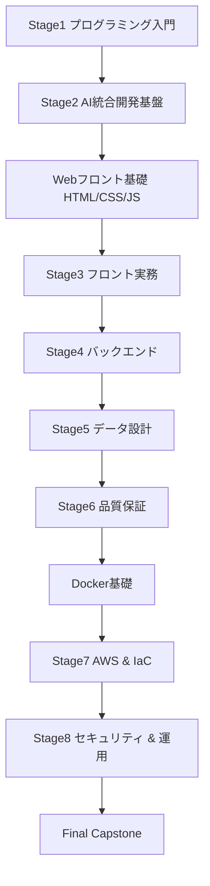

# 前提知識の接続

各 Stage の**入り口**（必要なスキル）と**出口**（修了時にできること）、および Stage 間の依存関係をまとめる。

- 週単位の詳細は [週単位カリキュラム](/weekly) を参照。

---

## 依存関係（全体）

---

## 入り口・出口一覧

| Stage | 入り口（必要なスキル） | 出口（修了時にできること） |
|--------|------------------------|----------------------------|
| **Stage 1** プログラミング入門 | 準備フェーズ修了（PC・用語・環境構築を読了していること）。プログラミング経験は不要 | 変数・分岐・ループ・関数でプログラムを書ける |
| **Stage 2** AI 統合開発基盤 | Stage 1 修了レベル | PR ベースで開発できる。要件→受入基準→境界設計ができる。AI 利用ポリシーを理解している |
| **Web フロント基礎** | Stage 2 修了レベル | HTML/CSS/JS で静的なページと軽い UI が書ける |
| **Stage 3** フロント実務 | Web フロント基礎 + Stage 2 | 仕様変更に強い UI 設計。型駆動開発。API 連携・エラーハンドリング |
| **Stage 4** バックエンド | Stage 3 修了レベル（API の利用イメージがあるとよい） | MVC・認可・トランザクション設計。API 設計・OpenAPI。Queue/Mail |
| **Stage 5** データ設計 | Stage 4 修了レベル | インデックス・EXPLAIN・N+1・分離レベル・Redis。遅いクエリの原因を説明できる |
| **Stage 6** 品質保証 | Stage 4〜5 の実装があること | Unit/Integration テスト、CI 強制、静的解析。カバレッジ 70% 以上を目指せる |
| **Docker 基礎** | Stage 6 修了レベル | コンテナ・イメージ・Dockerfile を理解し、ローカルでコンテナ実行できる |
| **Stage 7** AWS & IaC | Docker 基礎修了レベル | VPC・IAM・RDS・S3・ECS。Terraform で dev/stg/prod を再現できる |
| **Stage 8** セキュリティ & 運用 | Stage 7 修了レベル | OWASP 再現・RBAC・脅威モデリング。構造化ログ・アラート・ポストモーテム |
| **Final Capstone** | Stage 8 修了レベル | 要件定義〜監視まで一気通貫で実施できる |

---

## 週単位カリキュラムとの対応

| 週の範囲 | 内容 | 週単位カリキュラムの該当 |
|----------|------|---------------------------|
| 第 1〜3 週 | Stage 1 | [Stage 1：プログラミング入門](/weekly#stage-1プログラミング入門) |
| 第 4〜6 週 | Stage 2 | [Stage 2：AI 統合開発基盤](/weekly#stage-2ai-統合開発基盤) |
| 第 7〜8 週 | Web フロント基礎 | [Web フロント基礎](/weekly#web-フロント基礎htmlcssjs) |
| 第 9〜12 週 | Stage 3 | [Stage 3：フロント実務](/weekly#stage-3フロント実務react--ts) |
| 第 13〜16 週 | Stage 4 | [Stage 4：バックエンド](/weekly#stage-4バックエンドlaravel) |
| 第 17〜19 週 | Stage 5 | [Stage 5：データ設計](/weekly#stage-5データ設計) |
| 第 20〜22 週 | Stage 6 | [Stage 6：品質保証](/weekly#stage-6品質保証) |
| 第 23 週 | Docker | [Docker 基礎](/weekly#docker-基礎) |
| 第 24〜27 週 | Stage 7 | [Stage 7：AWS & IaC](/weekly#stage-7aws--iac) |
| 第 28〜30 週 | Stage 8 | [Stage 8：セキュリティ & 運用](/weekly#stage-8セキュリティ--運用) |
| 第 31〜36 週 目安 | Capstone | [Final：Capstone](/weekly#final-capstone) |
